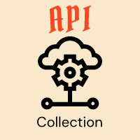

<p align="center" target="_blank">
    <a href="https://api-collection.netlify.app/ ">
        
    </a>
</p>
<h1 align="center" style="border: 0;"> API Collection </h1>

API Collection is a collective initative by [@gdscfetju](https://gdscfetju.co) to list all the API's available on the internet. The project is open source and anyone can contribute to the project.

## Table Of Contents

- [Prerequisites](#prerequisites)
- [Installation](#installation)
- [Author](#author)
- [Contributors](#contributors)
- [Contribution](#contribution)
- [License](#license)

## Prerequisites

You need to have the following installed on your machine.

- [Node.js](https://nodejs.org/en/)
- [pnpm](https://pnpm.js.org/) (preferred)

## Installation

You can `fork` the project.
[Fork this repo](https://github.com/gdsc-fetju/api-collection/fork)

```
git clone https://github.com/<your-username>/api-collection
cd api-collection
pnpm install
pnpm run dev
```

## Author

**Author Name** &nbsp; : &nbsp; Sargam Poudel <br>
**Author URI** &nbsp; &nbsp; &nbsp; : &nbsp; [www.sargam.me](https://www.sargam.me) <br>
**GitHub URI** &nbsp; &nbsp; &nbsp; : &nbsp; [devsargam](https://github.com/devsargam)

## Contributors

List of all Contributors:

<a href="https://github.com/gdsc-fetju/api-collection/graphs/contributors">

</a>

## Contribution

This project is to document the API's available on the internet. If you want to contribute, pull requests/merge requests are always welcome.

Check the [installation](#installation) section to start contributing to this project.

- [CODE OF CONDUCT](CODE_OF_CONDUCT.md)
- [CONTRIBUTING](CONTRIBUTING.md)

## License

[](https://opensource.org/licenses/MIT)

Thank you for using this documentation. If you love this project give it a star.

[Star this repo ⭐](https://github.com/gdsc-fetju/api-collection)
